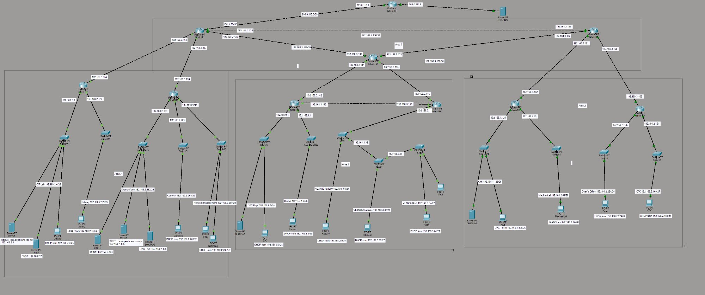

 IOE Pulchowk Campus Network Design
**Mini Project — Computer Networks | Tribhuvan University, IOE Pulchowk Campus**

| File | Description |
|------|-------------|
| `mini_project.pkt` | Cisco Packet Tracer simulation file |
| `Pulchowk_Network_Design_Report.docx` | Full project report |
| `README.md` | Project documentation (this file) |
| `topology.png` | Network topology diagram |

---

## 📸 Network Topology

*Fig: Complete Network Topology — IOE Pulchowk Campus*

---

## 1. Project Overview

This project presents a complete network design for **IOE Pulchowk Campus, Lalitpur**, simulated in Cisco Packet Tracer. The campus network connects **10 zones**:

- Electronics & Computer (E&C)
- Civil Engineering
- Mechanical Engineering
- CIT Lab
- Library
- Hostel
- Canteen
- ICTC
- Dean's Office
- Server Farm (centralized services)

### Key Features
- ✅ **IP Block** — 192.168.0.0/22 with VLSM across 14 subnets using 6 different prefix lengths
- ✅ **Multi-area OSPF** — Area 0 backbone + Areas 1, 2, 3 with redundant paths
- ✅ **3 VLANs** — Faculty (VLAN10), Students (VLAN20), Staff (VLAN30) across 3 switches
- ✅ **Per-area DHCP** — 3 distributed DHCP servers with ip helper-address relay
- ✅ **Dual DNS** — Primary DNS1 + Secondary DNS2 on separate subnets
- ✅ **ISP DNS** — External DNS server in ISP network for public domain resolution
- ✅ **2 Web Servers** — www.pulchowk.edu.np and labs.pulchowk.edu.np on different subnets
- ✅ **ISP Connectivity** — Static default route + OSPF redistribution
- ✅ **Redundant paths** — Area 0 ring (R1-R2-R3-R1) + R4-R5 direct link in Area 1
- ✅ **Security** — Console, enable, and telnet passwords on all routers

---

## 2. Device Summary

| Device | Model | Role |
|--------|-------|------|
| R1 | Cisco 2911 | ASBR + ABR — Backbone, connects to ISP |
| R2 | Cisco 2911 | ABR — Backbone to Area 1 |
| R3 | Cisco 2911 | ABR — Backbone to Area 2 |
| R4 | Cisco 2911 | Internal — E&C, Hostel (Area 1) |
| R5 | Cisco 2911 | Internal — VLANs via router-on-a-stick (Area 1) |
| R6 | Cisco 2911 | Internal — Civil, Mechanical (Area 2) |
| R7 | Cisco 2911 | Internal — CIT Lab, Library (Area 3) |
| R8 | Cisco 2911 | Internal — Server Farm, Canteen, Net Mgmt (Area 3) |
| R9 | Cisco 2911 | Internal — ICTC, Dean's Office (Area 2) |
| ISP | Cisco 2911 | Simulates internet connectivity |
| SW1, SW2, SW3 | Cisco 2960 | VLAN trunk chain — Faculty/Students/Staff |
| Area Switches | Cisco 2960 | Department-level access switches |
| DNS1 | Server-PT | Primary authoritative DNS — Server Farm |
| DNS2 | Server-PT | Secondary/caching DNS — CIT Lab subnet |
| WEB1 | Server-PT | Main campus web portal — Server Farm |
| WEB2 | Server-PT | CIT lab portal — CIT Lab subnet |
| DHCP-A1 | Server-PT | Area 1 DHCP server |
| DHCP-A2 | Server-PT | Area 2 DHCP server |
| DHCP-A3 | Server-PT | Area 3 DHCP server |
| ISP-DNS | Server-PT | External DNS in ISP network |

---

## 3. IP Addressing Plan

### Address Block: `192.168.0.0/22`
- Total usable hosts: **1022**
- Range: `192.168.0.0` – `192.168.3.255`
- Subnetting method: **VLSM** (Variable Length Subnet Masking)

---

### 3.1 LAN Subnets

| Department | Network ID | Subnet Mask | Host Range | Hosts | Area |
|------------|-----------|-------------|------------|-------|------|
| E&C Department | 192.168.0.0 | /24 — 255.255.255.0 | .1 – .254 | 254 | 1 |
| Hostel | 192.168.1.0 | /25 — 255.255.255.128 | .1 – .126 | 126 | 1 |
| Civil Engineering | 192.168.1.128 | /25 — 255.255.255.128 | .129 – .254 | 126 | 2 |
| CIT Lab | 192.168.2.0 | /26 — 255.255.255.192 | .1 – .62 | 62 | 3 |
| Mechanical Engg | 192.168.2.64 | /26 — 255.255.255.192 | .65 – .126 | 62 | 2 |
| Library | 192.168.2.128 | /27 — 255.255.255.224 | .129 – .158 | 30 | 3 |
| ICTC | 192.168.2.160 | /27 — 255.255.255.224 | .161 – .190 | 30 | 2 |
| Server Farm | 192.168.2.192 | /28 — 255.255.255.240 | .193 – .206 | 14 | 3 |
| Canteen | 192.168.2.208 | /28 — 255.255.255.240 | .209 – .222 | 14 | 3 |
| Dean's Office | 192.168.2.224 | /28 — 255.255.255.240 | .225 – .238 | 14 | 2 |
| Network Management | 192.168.2.240 | /29 — 255.255.255.248 | .241 – .246 | 6 | 3 |
| VLAN10 — Faculty | 192.168.3.0 | /27 — 255.255.255.224 | .1 – .30 | 30 | 1 |
| VLAN20 — Students | 192.168.3.32 | /27 — 255.255.255.224 | .33 – .62 | 30 | 1 |
| VLAN30 — Staff | 192.168.3.64 | /27 — 255.255.255.224 | .65 – .94 | 30 | 1 |

---

### 3.2 Router-to-Router Links (/30 Point-to-Point)

| Link | Network ID | Router A IP | Router B IP | Remark |
|------|-----------|------------|------------|--------|
| R1 – R2 | 192.168.3.128/30 | 192.168.3.129 | 192.168.3.130 | Area 0 Backbone |
| R2 – R3 | 192.168.3.132/30 | 192.168.3.133 | 192.168.3.134 | Area 0 Backbone |
| R3 – R1 | 192.168.3.136/30 | 192.168.3.137 | 192.168.3.138 | Area 0 Backbone |
| R2 – R4 | 192.168.3.140/30 | 192.168.3.141 | 192.168.3.142 | ABR to Area 1 |
| R2 – R5 | 192.168.3.144/30 | 192.168.3.145 | 192.168.3.146 | ABR to Area 1 |
| R4 – R5 | 192.168.3.148/30 | 192.168.3.149 | 192.168.3.150 | Area 1 Redundant Path |
| R1 – R7 | 192.168.3.152/30 | 192.168.3.153 | 192.168.3.154 | ABR to Area 3 |
| R1 – R8 | 192.168.3.156/30 | 192.168.3.157 | 192.168.3.158 | ABR to Area 3 |
| R3 – R6 | 192.168.3.160/30 | 192.168.3.161 | 192.168.3.162 | ABR to Area 2 |
| R3 – R9 | 192.168.3.164/30 | 192.168.3.165 | 192.168.3.166 | ABR to Area 2 |
| R1 – ISP | 203.0.113.0/30 | 203.0.113.2 | 203.0.113.1 | WAN Uplink |

---

### 3.3 Server Static IPs

| Server | IP Address | Subnet Mask | Gateway | DNS | Purpose |
|--------|-----------|-------------|---------|-----|---------|
| DHCP-A1 | 192.168.0.2 | 255.255.255.0 | 192.168.0.1 | 192.168.2.194 | Area 1 DHCP |
| DHCP-A2 | 192.168.1.130 | 255.255.255.128 | 192.168.1.129 | 192.168.2.194 | Area 2 DHCP |
| DHCP-A3 | 192.168.2.196 | 255.255.255.240 | 192.168.2.193 | 192.168.2.194 | Area 3 DHCP |
| DNS1 | 192.168.2.194 | 255.255.255.240 | 192.168.2.193 | 192.168.2.194 | Primary DNS |
| DNS2 | 192.168.2.2 | 255.255.255.192 | 192.168.2.1 | 192.168.2.194 | Secondary DNS |
| WEB1 | 192.168.2.195 | 255.255.255.240 | 192.168.2.193 | 192.168.2.194 | www.pulchowk.edu.np |
| WEB2 | 192.168.2.3 | 255.255.255.192 | 192.168.2.1 | 192.168.2.194 | labs.pulchowk.edu.np |
| ISP-DNS | 203.0.113.10 | 255.255.255.252 | 203.0.113.9 | 203.0.113.10 | External DNS |

---

## 4. VLAN Implementation

Three VLANs implemented using **802.1Q trunking** across SW1 → SW2 → SW3 chain. R5 connects to SW1 using **router-on-a-stick**.

| VLAN | Name | Network | Gateway | Switch |
|------|------|---------|---------|--------|
| 10 | Faculty | 192.168.3.0/27 | 192.168.3.1 | SW1 |
| 20 | Students | 192.168.3.32/27 | 192.168.3.33 | SW2 |
| 30 | Staff | 192.168.3.64/27 | 192.168.3.65 | SW3 |

- **Trunk ports** — SW1↔SW2, SW2↔SW3, SW1↔R5 carry all VLANs
- **Access ports** — PC-facing ports assigned to respective VLANs

---

## 5. OSPF Multi-Area Configuration

| Area | Routers | Coverage |
|------|---------|----------|
| Area 0 (Backbone) | R1, R2, R3 | Pure backbone ring — no LAN interfaces, all ABRs |
| Area 1 | R4, R5 | E&C, Hostel, VLAN 10/20/30 |
| Area 2 | R6, R9 | Civil, Mechanical, ICTC, Dean's Office |
| Area 3 | R7, R8 | CIT Lab, Library, Server Farm, Canteen, Net Mgmt |

- **Redundant paths** — Area 0 ring (R1-R2-R3-R1) + direct R4-R5 link in Area 1
- **Default route** — R1: `ip route 0.0.0.0 0.0.0.0 203.0.113.1` + `default-information originate`
- **ISP static route** — `ip route 192.168.0.0 255.255.252.0 203.0.113.2` — single entry covers entire /22

---

## 6. DHCP Design (Per-Area with Relay)

| Server | IP | Location | Serves |
|--------|-----|----------|--------|
| DHCP-A1 | 192.168.0.2 | E&C Dept (Area 1) | E&C, Hostel, VLAN10/20/30 |
| DHCP-A2 | 192.168.1.130 | Civil Engg (Area 2) | Civil, Mechanical, ICTC, Dean's Office |
| DHCP-A3 | 192.168.2.196 | Server Farm (Area 3) | CIT Lab, Library, Canteen, Net Mgmt |

Routers use `ip helper-address` on each LAN interface to relay DHCP broadcasts to area server.
Each pool provides: **IP address, subnet mask, default gateway, DNS server (192.168.2.194)**.

---

## 7. DNS and Web Servers

### DNS Records (configured on DNS1 and DNS2)

| Name | Type | Address |
|------|------|---------|
| www.pulchowk.edu.np | A Record | 192.168.2.195 |
| labs.pulchowk.edu.np | A Record | 192.168.2.3 |
| dns1.pulchowk.edu.np | A Record | 192.168.2.194 |
| dns2.pulchowk.edu.np | A Record | 192.168.2.2 |

### Web Servers

| Server | IP | URL | Content |
|--------|-----|-----|---------|
| WEB1 | 192.168.2.195 | www.pulchowk.edu.np | Main campus portal |
| WEB2 | 192.168.2.3 | labs.pulchowk.edu.np | CIT student lab portal |

---

## 8. Security and Management

| Feature | Value |
|---------|-------|
| Console password | `cisco` |
| Enable secret | `class` |
| Telnet (VTY 0-4) password | `network` |
| VLAN isolation | Faculty/Student/Staff traffic separated |
| Distributed DHCP | No single point of failure |
| Dual DNS | Redundant name resolution on separate subnets |

---

## 9. Testing Results

| Test | Result |
|------|--------|
| All router links green | ✅ Verified |
| PC gets IP via DHCP | ✅ All 13 PCs verified |
| Inter-area ping (Area 1 → Area 3) | ✅ Working |
| Ping to ISP (203.0.113.1) | ✅ Working from all PCs |
| Web browser — www.pulchowk.edu.np | ✅ Page loads |
| Web browser — labs.pulchowk.edu.np | ✅ Custom page loads |
| Telnet to routers | ✅ Working |
| VLAN isolation | ✅ Verified |

---

## 📄 Full Report

Full project report available here: [`Pulchowk_Network_Design_Report.docx`](./Pulchowk_Network_Design_Report.docx)

---

*Submitted to: Department of Electronics and Computer Engineering, Pulchowk Campus, Lalitpur, Nepal*

*March, 2026*
